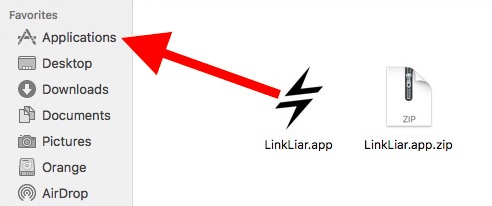

# Installation

## 📥 Download the app

Head over to the [Download Section](https://github.com/halo/LinkLiar/releases/latest) and get the zip file.

## 📦 Extract the zip file (if needed)

Simply by double-clicking it.

## 📂 Drag and drop the app to your Applications folder

## ▶️ Run the app

Just double-click it.

## 👮🏼‍♀️ Authorize it

Click on the app icon in your top menu bar and choose "Authorize".

You will then be asked for your computer password.

(You will only have to do this once, in order to give LinkLiar the permission to change your MAC address).

# [How to use LinkLiar...](usage.html)
