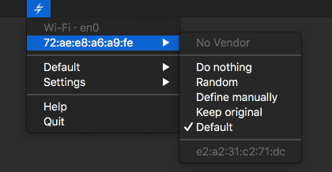

# Usage

Once you authorized LinkLiar (see [Installation](installation.html)), you can get started.

## ⚠️ Attention, mind the gap

Remember that if you change the MAC address of your Wi-Fi **while connected**,
you will **loose connection.**

Wait one minute or turn the Wi-Fi off and on again to reconnect properly.

## 👆🏻 First things first

Initially, LinkLiar does nothing at all.

So, I recommend you do the one useful change, which is setting the **Default**
to **Random**.

For beginners: you can now close this manual and sleep in peace. You're all set.

All others: Let's look at what those individual options do with your MAC addresses:

### 🛌 Do nothing

Simply ignore this interface.
Whatever the MAC address is, do not modify it.

(You will also not be warned about leakage with an icon for this interface if it is using its original MAC address.)

### 🎲 Random

Make sure that the MAC address is never the original one.
It the MAC address already is random, it re-randomizes when you click on this.

Pro-tip: The address can periodically be re-randomized, see [Settings](settings.html).

By default, the MAC address will use a prefix by Apple and a completely random suffix.
Advanced users may customize which prefixes LinkLiar should use by holding the Option ⌥ ke –
this will reveal a new menu item called "Prefixes".

### ✏️ Define manually

Keep the MAC address to what you specifically say it should be.

### ♻️ Keep original

If the MAC address is not the original one, reset it to the original.

### 📖 Default

Defer the configuration of this interface so that whatever has been
defined in the "Default" menu applies to this interface.

For example, if the default is "Random" and you plugin an ethernet cable,
it will immediately be randomized.

## ▶️ What's next?

Learn [about the settings...](settings.html)
