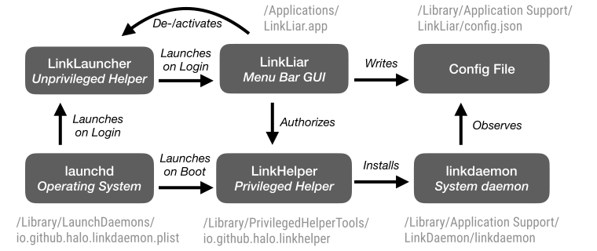

[](https://github.com/halo/LinkLiar/releases)
[]()
[](https://github.com/halo/LinkLiar/blob/master/LICENSE.md)
[](https://travis-ci.org/halo/LinkLiar)
[](https://github.com/halo/linkliar/issues)
[](https://github.com/halo/linkliar/issues?q=is%3Aissue+is%3Aclosed)
[](https://github.com/halo/LinkLiar/commits/master)
[](https://gitter.im/halo/LinkLiar)

## Prevent your Mac from leaking MACs

This is an intuitive macOS status menu application written in Swift to help you spoof the MAC addresses of your Wi-Fi and Ethernet interfaces.

[Download instructions](#installation)

It is free as in open-source. Should you like to motivate me, you may click on the ✭ in the top-right corner.


## Requirements

* macOS Sierra or later (see [releases](https://github.com/halo/LinkLiar/releases) for older versions)
* Administrator privileges (you will be asked for your root password **once**)

## Installation

If you have [Homebrew](https://brew.sh), just run `brew install --cask linkliar`.

To install it manually, follow [these instructions](http://halo.github.io/LinkLiar/installation.html).

## Documentation

The end-user documentation is located at [halo.github.io/LinkLiar](http://halo.github.io/LinkLiar).

What you're looking at right now is the technical documentation.

There is also a source-code documentation in progress, see `bin/docs` for inspiration.

## Limitations/Caveats

* When your Wi-Fi (aka Airport) is turned off, you cannot change its MAC address. You need to turn it on first.
* If you change a MAC address while the interface is connected, you will briefly loose connection.
* If you rapidly close and open your MacBook, the MAC address may change while the Wi-Fi connection remains and you loose the connection.
* Whenever you successfully changed your MAC address, your `System Preferences` will still show you the original hardware MAC address.
  This is normal behavior and your actual network traffic uses the *new*, *changed* MAC address.
* Choosing a "random vendor" prefix does **not** choose from **all** possible vendors, but only from
  the most commonly known vendors ([these](https://github.com/halo/LinkLiar/blob/28c1853cb52c3edda797dbfd3670774d33dee613/linkdaemon/Classes/OuiPrefixes.swift#L17))).
* 2018 Macbooks (and later) cannot change their MAC address, [for unknown reasons](https://github.com/feross/SpoofMAC/issues/87#issuecomment-485280175).

## Troubleshooting

You can create this logfile and whenever it exists, all  LinkLiar components will write to it:

```bash
touch "/Library/Application Support/LinkLiar/linkliar.log"
```

Delete the log file again to silence logging.

Once LinkLiar is started and the menu is visible, you can hold the ⌥ Option key for advanced options. This is only intended for developers.

If you want a more colorful output, clone this git repository and run `bin/logs`.
That's what I use when I'm debugging.
This utility is also bundled in LinkLiar so you can run it with

```bash
/Applications/LinkLiar.app/Contents/Resources/logs
```

## Development



## Future work

* Add badge with test coverage to README
* Nicer GUI for specifying a MAC address manually (with option to randomize)
* Choose which vendor prefixes to randomize with

## Thanks

* The icon in `Link/Images.xcassets` is from [Iconmonstr](http://iconmonstr.com).

## License

MIT 2012-2018 halo. See [MIT-LICENSE](https://github.com/halo/LinkLiar/blob/master/LICENSE.md).
